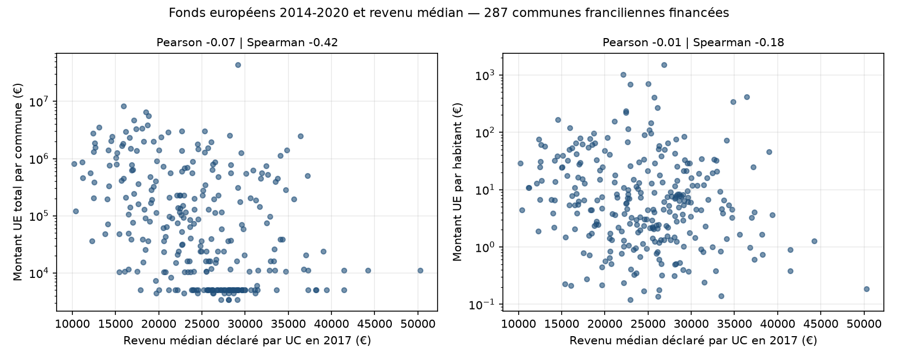
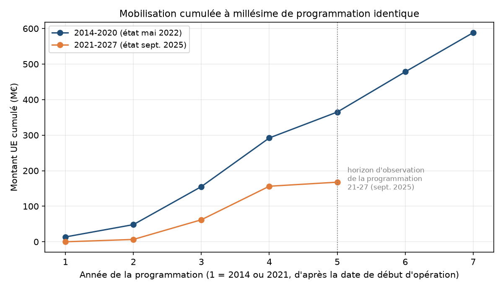
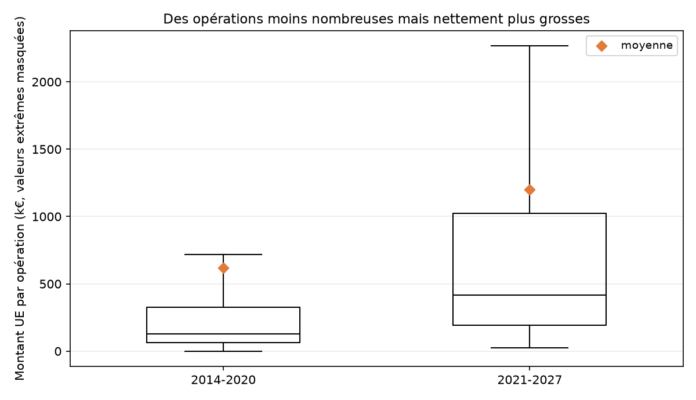
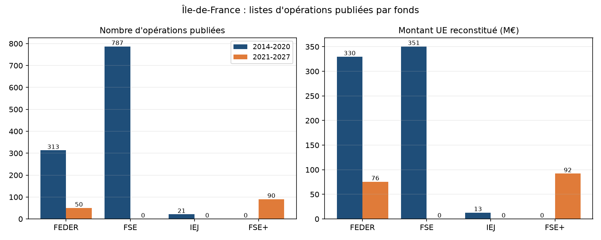

Méthode, outils et conventions de calcul : voir `METHODOLOGIE.md`. Tous les chiffres sont produits
par les scripts livrés, aucun n'est saisi à la main.

# Synthèse

1. **Le jeu de données ne contient pas le montant des fonds européens** : il faut le reconstituer
   (coût éligible × taux de cofinancement). Résultat : **693,2 M€ d'aide UE** pour 1 668,9 M€ de
   dépenses éligibles sur 1 121 opérations.
2. **Financement très concentré** : le top 10 pèse **38,6 %** du montant UE, et 8 de ces 10
   opérations sont portées par la Région ou Bpifrance.
3. **Seine-Saint-Denis premier département** (112,6 M€ ; 18,1 %), devant Paris (98,7 M€). Rapport
   du premier au dernier : 1,8.
4. **La corrélation fonds / revenu médian n'est pas concluante** : faible, négative, et calculée
   sur **26 % seulement du montant UE** — seule fraction rattachable à une commune identifiable.
5. **De 14-20 à 21-27, le modèle change plus que le volume** : à millésime égal, 54 % du rythme
   précédent, mais des opérations **3,2 fois plus grosses** en médiane.

# 1. Analyse de données

## 1.1 Top 10 des opérations les plus financées

Classement sur le montant UE reconstitué ; le coût total éligible figure dans le même tableau, les
deux lectures partageant 9 opérations sur 10.

| Bénéficiaire | Opération | Fonds | Coût élig. (M€) | Montant UE (M€) |
|:---|:---|:---|---:|---:|
| Bpifrance Financement | Fonds de prêts rebond FEDER Île-de-France | FEDER | 132,50 | 50,00 |
| Région Île-de-France | REACT-EU — équipements numériques | FEDER | 105,00 | 42,00 |
| Conseil régional IdF | Programme régional formation et emploi | FSE | 51,83 | 25,92 |
| Conseil régional IdF | Programme qualifiant « Compétences » | FSE | 50,52 | 25,26 |
| Conseil régional IdF | Programme formation et emploi 2018 | FSE | 49,15 | 24,57 |
| Région Île-de-France | Équipements numériques individuels | FEDER | 60,95 | 24,38 |
| Conseil régional IdF | Programme qualifiant « Compétences » PRC | FSE | 45,63 | 22,81 |
| Conseil régional IdF | Dispositif « Avenir Jeunes » | FSE | 43,49 | 21,74 |
| Conseil régional IdF | Paris Region Venture Fund | FEDER | 32,80 | 16,40 |
| Conseil régional IdF | Programme qualifiant « Compétences » PR | FSE | 29,46 | 14,73 |

267,8 M€ au total, soit 38,6 % de l'enveloppe. Deux profils dominent : **instruments financiers**
(fonds de prêts, capital-risque) et **programmes régionaux de formation**. Ce ne sont pas des
projets locaux, ce qui explique l'essentiel des limites du croisement communal en 1.3.

## 1.2 Groupement par département

Une opération peut citer plusieurs départements. Convention : elle est **comptée** dans chacun,
son montant est **réparti au prorata égal** entre eux — la somme des départements égale ainsi
exactement le total régional localisé.

| Département | Opérations | Montant UE réparti (M€) | Part | Moyenne/opération (€) |
|:---|---:|---:|---:|---:|
| 93 Seine-Saint-Denis | 396 | 112,63 | 18,1 % | 284 422 |
| 75 Paris | 340 | 98,72 | 15,9 % | 290 362 |
| 94 Val-de-Marne | 265 | 73,82 | 11,9 % | 278 566 |
| 77 Seine-et-Marne | 251 | 70,95 | 11,4 % | 282 687 |
| 95 Val-d'Oise | 278 | 69,46 | 11,2 % | 249 839 |
| 78 Yvelines | 255 | 67,93 | 10,9 % | 266 397 |
| 91 Essonne | 240 | 67,43 | 10,8 % | 280 957 |
| 92 Hauts-de-Seine | 216 | 61,72 | 9,9 % | 285 748 |

Par fonds (montant UE réparti, M€) :

| | 75 | 77 | 78 | 91 | 92 | 93 | 94 | 95 |
|:---|---:|---:|---:|---:|---:|---:|---:|---:|
| FEDER | 42,23 | 39,50 | 35,40 | 38,76 | 35,20 | 58,87 | 42,50 | 35,69 |
| FSE | 56,07 | 31,04 | 32,12 | 28,25 | 26,11 | 43,72 | 30,91 | 33,34 |
| IEJ | 0,42 | 0,42 | 0,42 | 0,42 | 0,42 | 10,04 | 0,42 | 0,42 |

- La Seine-Saint-Denis capte **10,04 des 12,97 M€ d'IEJ** ; les sept autres départements se
  partagent le reste à parts égales (0,42 M€), signe d'opérations régionales réparties mécaniquement.
- Paris est le seul département où le FSE dépasse nettement le FEDER.
- **68,5 M€ (9,9 %) ne sont rattachables à aucun département** : 10 opérations sans département.
- 13 rattachements visent 7 départements **hors Île-de-France** pour 2,06 M€ : opérations du
  bassin de la Seine, sans indicateur permettant de les isoler.

## 1.3 Croisement avec le revenu médian INSEE

Source : INSEE FiLoSoFi 2017, fichier communal des revenus **déclarés**, indicateur `Q217` (médiane
du revenu déclaré par unité de consommation des ménages fiscaux). 1 260 communes franciliennes,
médiane renseignée pour les 1 260.

| Périmètre | Variable | Pearson | Spearman |
|:---|:---|---:|---:|
| Communes financées (n = 287) | Montant UE total | −0,074 | −0,423 |
| Communes financées (n = 287) | Montant UE par habitant | −0,006 | −0,178 |
| Toutes communes franciliennes (n = 1 252) | Montant UE total | −0,085 | −0,208 |
| Toutes communes franciliennes (n = 1 252) | Montant UE par habitant | −0,054 | −0,188 |

Le sens est celui attendu d'une politique de cohésion — les communes les moins aisées reçoivent
plutôt davantage — mais la relation est **faible et instable** : Pearson quasi nul (distribution
très asymétrique), Spearman de −0,42 qui **tombe à −0,21** dès qu'on réintègre les 965 communes
sans opération, et presque nul par habitant. **En l'état des données, aucune corrélation
exploitable ne peut être établie.**

## 1.4 Limites de l'exercice en l'état des données

1. **Aucun code commune INSEE** dans le jeu : la localisation est du texte libre (`PARIS`,
   `ÎLE-DE-FRANCE`, `EPT PLAINE COMMUNE`, ou plusieurs communes empilées avec « : »).
   L'appariement se fait par libellé normalisé, faillible ; 4 homonymes franciliens sont écartés.
2. **26 % du montant UE seulement est rattachable à une commune** : 419 opérations sont localisées
   à la région ou au département. Les plus gros financements sont précisément ceux qui échappent à
   la maille communale.
3. **La maille communale n'est pas pertinente pour ces fonds** : la commune du bénéficiaire est
   souvent son siège social. On confond lieu de gestion et lieu d'effet.
4. **La convention de répartition crée ses propres artefacts** : le partage à parts égales produit
   des valeurs identiques, visibles en bande horizontale sur le graphique.
5. **Décalage temporel** : fonds 2014-2022, revenu 2017 — aucune causalité établissable.
6. **L'indicateur n'est pas exactement celui demandé** : la médiane publiée l'est **par unité de
   consommation**, non par foyer fiscal.
7. **Montants programmés, non versés.**

# 2. Qualité des données et pistes d'amélioration

## Niveau de qualité : suffisant pour l'obligation de publicité, insuffisant pour l'analyse

11 des 13 colonnes sont renseignées à 100 %. Les manques ne sont donc pas volumétriques mais
**structurels** : ce qui manque est ce qui rend la donnée exploitable.

| Dimension | Constat | Mesure |
|:---|:---|:---|
| Complétude | **Aucune colonne de montant UE** | à reconstituer (coût × taux) |
| Complétude | **Aucun identifiant d'opération ni code commune INSEE** | tout rapprochement repose sur des libellés |
| Complétude | Catégorie d'intervention | **225 / 1 121 (20,1 %)** : analyse thématique impossible sur 4 opérations sur 5 |
| Complétude | Département non renseigné | 10 opérations = **68,5 M€ non localisables (9,9 %)** |
| Exactitude | Codes département invalides | 4 codes : `2`, `3`, **`3.2153009259259258`**, `97` |
| Exactitude | Taux de cofinancement > 50 % | 88 opérations, dont 10 FEDER jusqu'à 70 % (l'IEJ peut légitimement dépasser) |
| Exactitude | Taux et coût nuls / fin hors période | 1 opération à 0 € ; 1 opération finissant le 30/09/2027 |
| Cohérence | Localisation multivaluée dans une chaîne | 169 opérations (séparateur « : ») ; 419 non communales |
| Cohérence | Périmètre annoncé non tenu | le FEADER est décrit sur data.gouv, absent du fichier |
| Fraîcheur | Dernière mise à jour | **3 mai 2022**, pour une programmation ouverte jusqu'au 31/12/2023 |

Deux anomalies à citer telles quelles, parce qu'elles révèlent une **saisie non contrôlée** et non
un incident isolé : un code département valant `3.2153009259259258` (valeur décimale dans un champ
de code, trace d'un calcul tableur) ; une opération parisienne portant à la fois `75` et `075`,
donc comptée deux fois sans normalisation.

## Impacts

- **Transparence en trompe-l'œil** : le citoyen lit les bénéficiaires, pas le montant d'aide
  européenne. L'obligation est formellement remplie, son objet non.
- **Non-réutilisabilité** : sans identifiant ni code commune, aucun croisement fiable avec INSEE,
  SIRENE ou un autre programme.
- **Analyse territoriale non reproductible** : faute de convention publiée sur le champ multivalué,
  deux analystes produiront deux chiffres départementaux différents.
- **Pilotage impossible** : sans catégorie d'intervention sur 80 % des opérations, pas de suivi
  thématique ni de contrôle des concentrations réglementaires.
- **Risque de conclusion erronée** : le coefficient de la question 1 varie de −0,42 à −0,18 selon
  le périmètre. Sans conventions explicites, on pourrait affirmer un ciblage social que les données
  n'établissent pas.

## Pistes proposées

**À la source — l'essentiel du gain**

1. **Publier le montant UE comme donnée** (programmé, et idéalement payé) plutôt que comme calcul.
2. **Ajouter l'identifiant d'opération** du système de gestion (Synergie, Ma démarche FSE), clé du
   suivi dans le temps et du rapprochement financier.
3. **Remplacer les libellés de localisation par des codes officiels** (INSEE, NUTS 3), une ligne
   par territoire. Le fichier 21-27 le prévoit déjà (`REG/11/Île-de-France | COMM/93066/…`) — mais
   ne le renseigne que pour 727 de ses 5 148 lignes.
4. **Contrôler à la saisie** : liste fermée de codes département, bornes sur le taux avec
   dérogation explicite pour l'IEJ, date de fin dans la période d'éligibilité, catégorie
   d'intervention obligatoire puisqu'exigée par la Commission.

**Sur la publication**

5. **Aligner la fiche descriptive sur le contenu réel** (le FEADER annoncé est absent) et publier
   un **dictionnaire des variables** — condition pour que deux réutilisateurs obtiennent le même
   résultat.
6. **Rétablir une fréquence de mise à jour**, le règlement 2021/1060 imposant désormais au moins
   cinq publications par an.

**Sans toucher à la source**

7. **Diffuser une couche retraitée** — montant UE calculé, codes normalisés, une ligne par couple
   opération/territoire, code INSEE apparié — **accompagnée du script qui la produit**, de façon
   que la convention soit publique et auditable. C'est ce que fait le code livré ici.

# 3. Réponse à la question posée

> *Les 3 départements d'Île-de-France ayant bénéficié du plus grand nombre d'opérations FEDER entre
> 2014 et 2020, et le montant moyen par opération pour chacun.*

**Paris (99 opérations), Seine-Saint-Denis (95) et Val-de-Marne (93)**, sur les 313 opérations
FEDER du jeu. Montant UE moyen par opération : **2,04 M€, 2,31 M€ et 2,18 M€**.

| Département | Opérations FEDER | Montant UE réparti (M€) | Moyenne/opération (€) | Variante prorata (€) |
|:---|---:|---:|---:|---:|
| **75 Paris** | **99** | 42,23 | **2 044 370** | 426 592 |
| **93 Seine-Saint-Denis** | **95** | 58,87 | **2 310 656** | 619 683 |
| **94 Val-de-Marne** | **93** | 42,50 | **2 181 590** | 456 949 |
| 91 Essonne | 82 | 38,76 | 2 433 782 | 472 741 |
| 77 Seine-et-Marne | 78 | 39,50 | 2 567 142 | 506 370 |
| 78 Yvelines | 77 | 35,40 | 2 541 570 | 459 676 |
| 92 Hauts-de-Seine | 76 | 35,20 | 2 575 189 | 463 096 |
| 95 Val-d'Oise | 69 | 35,69 | 2 838 160 | 517 305 |

- **Classement serré** : 6 opérations d'écart entre le 1ᵉʳ et le 3ᵉ, aucune rupture nette dans la
  distribution.
- **Mais robuste** : 60 des 313 opérations sont multi-départementales ; en ne gardant que les
  mono-départementales, le trio est inchangé — Paris (47), Seine-Saint-Denis (42), Val-de-Marne (41).
- **Le montant moyen dépend entièrement de la convention.** La colonne principale retient le
  montant UE **intégral** de chaque opération rattachée au département : lecture littérale de la
  question, mais une opération régionale y compte en entier dans les huit départements. La variante
  le divise par le nombre de départements concernés (430 à 620 k€). Les deux sont exactes et ne
  répondent pas à la même question. D'où le fait que la Seine-Saint-Denis, 2ᵉ en nombre, soit
  **1ʳᵉ en montant** (58,87 contre 42,23 M€).

# 4. Évolution de la mobilisation entre 14-20 et 21-27

Périmètre : programme régional Île-de-France. Les deux fichiers donnant coût éligible et taux, le
montant UE est reconstitué de la même façon des deux côtés. *Méthode de production détaillée en
section 4.5 de `METHODOLOGIE.md`.*

Listes arrêtées au 03/05/2022 pour 14-20 et au 08/09/2025 pour 21-27 ; les deux dernières
colonnes donnent le montant UE par opération.

| Période | Opérations | Coût élig. (M€) | Montant UE (M€) | Taux UE | Moyenne (€) | Médiane (€) |
|:---|---:|---:|---:|:---|---:|---:|
| 2014-2020 | 1 121 | 1 668,9 | 693,2 | 41,5 % | 618 395 | 130 076 |
| 2021-2027 | 140 | 417,4 | 167,7 | 40,2 % | 1 198 056 | 416 841 |

## Point clé 1 — Un rythme deux fois plus lent

Opposer 693 à 168 M€ n'aurait aucun sens : les listes sont photographiées à des stades différents.
Alignées sur l'année de programmation, elles sont comparables jusqu'à la 4ᵉ année, la dernière
pleinement observable des deux côtés : **156,3 M€ contre 292,2 M€, soit 54 % du rythme précédent**,
et **125 opérations contre 705**. Aucune opération ne débute en 2021, 10 seulement en 2022.

## Point clé 2 — Moins d'opérations, beaucoup plus grosses

Évolution la plus nette, et indépendante du stade d'avancement : la **médiane passe de 130 076 €
à 416 841 € (×3,2)**, la moyenne de 618 à 1 198 k€, et le premier quartile 21-27 (194 k€) dépasse
la médiane 14-20. Moins de charge de gestion par euro programmé, mais un accès resserré pour les
petits porteurs.

## Point clé 3 — Fonds recomposés, taux de cofinancement stable

- Le **FSE devient FSE+** et reste premier en montant (92,1 M€ ; 54,9 % contre 50,6 %).
- L'**IEJ disparaît** : 21 opérations et 12,97 M€, concentrés sur la Seine-Saint-Denis, sans
  équivalent dans la nouvelle architecture.
- Le **FTJ est absent d'Île-de-France** : aucun territoire régional retenu au titre de la
  transition juste.
- Le **taux de cofinancement est stable** (41,5 % puis 40,2 %) : l'effet de levier de l'euro
  européen n'a pas changé, c'est la taille et le nombre des projets qui ont bougé.

## Réserves

1. Ce sont des **photographies de publication, pas des états d'exécution**. La liste 14-20,
   arrêtée en mai 2022 pour une programmation courant jusqu'à fin 2023, est elle-même incomplète :
   l'écart de rythme mesuré est donc **sous-estimé**.
2. Le fichier 21-27 est une **extraction nationale** publiée par vagues : une opération engagée non
   encore remontée n'y figure pas.
3. Le programme 21-27 couvre « Île-de-France **et bassin de la Seine** », périmètre interrégional
   que la liste 14-20 traitait implicitement.
4. **Aucun fichier ne contient l'enveloppe programmée** : ces chiffres mesurent un volume publié,
   non un taux d'absorption. Le FSE+ fusionnant FSE, IEJ et FEAD, la comparaison par fonds n'est
   pas strictement à périmètre constant.
